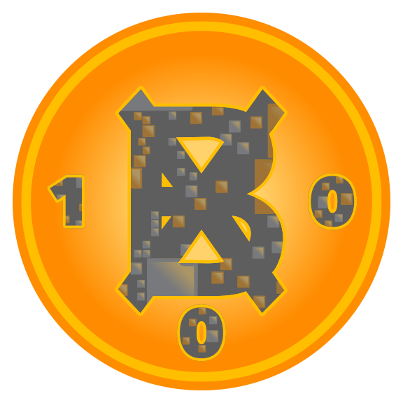

# bitnats

**🟠** the rarest digital artifacts **🟠**

# bx.bitnats

**⌽** bitnats' bits hex collection **⦶**

## basics

👉 bx.bitnats are [ordinal inscriptions](https://docs.ordinals.com/) on Bitcoin  
👉 bx.bitnats are on-chain claims to Bitcoin block data using the [tap protocol](https://github.com/Trac-Systems/tap-protocol-specs)  
👉 bx.bitnats are derived from Digital Matter Theory [DMT](https://digital-matter-theory.gitbook.io/digital-matter-theory)  
👉 bx.bitnats are generated each time a Bitcoin block is mined  
👉 bx.bitnats are available to mint on [mscribe.io](https://mscribe.io/nats?t=latest)  

## stats

the bx.bitnats [dune dashboard](https://dune.com/bitgnat/bx-bitnats) provides the following stats:  

📙 **Spectrum**: rarity classification for bitnats  
📙 **Supply**: dynamic supply of each bitnat  
📙 **Collection**: total supply of the bx.bitnats collection  
📙 **Rarity**: bitnat rarity as a percent of collection total supply  
📙 **Expansion**: percentage of blocks a bitnat generates  
📙 **Growth Rate**: overall growth rate of the collection  

## Unique Non-Arbitrary Tokens (UNATs)  

🟠 [bitnat-bx0](https://ordinals.com/inscription/8962d02cd3e827e68b1438d004e15bdc57720cc2cd8a2f2414bbfc5bdbbf9c23i0)  

🟠 [bitnat-bx00](https://ordinals.com/inscription/8962d02cd3e827e68b1438d004e15bdc57720cc2cd8a2f2414bbfc5bdbbf9c23i1)  

🟠 [bitnat-bx01](https://ordinals.com/inscription/8962d02cd3e827e68b1438d004e15bdc57720cc2cd8a2f2414bbfc5bdbbf9c23i3)  

🟠 [bitnat-bx1](https://ordinals.com/inscription/8962d02cd3e827e68b1438d004e15bdc57720cc2cd8a2f2414bbfc5bdbbf9c23i2)  

🟠 [bitnat-bx10](https://ordinals.com/inscription/8962d02cd3e827e68b1438d004e15bdc57720cc2cd8a2f2414bbfc5bdbbf9c23i4)  

🟠 [bitnat-bx11](https://ordinals.com/inscription/8962d02cd3e827e68b1438d004e15bdc57720cc2cd8a2f2414bbfc5bdbbf9c23i6)  

🟠 [bitnat-bx010](https://ordinals.com/inscription/8962d02cd3e827e68b1438d004e15bdc57720cc2cd8a2f2414bbfc5bdbbf9c23i5)  

🟠 [bitnat-bx011](https://ordinals.com/inscription/8962d02cd3e827e68b1438d004e15bdc57720cc2cd8a2f2414bbfc5bdbbf9c23i7)  

🟠 [bitnat-bx100](https://ordinals.com/inscription/8962d02cd3e827e68b1438d004e15bdc57720cc2cd8a2f2414bbfc5bdbbf9c23i8)  

🟠 [bitnat-bx101](https://ordinals.com/inscription/8962d02cd3e827e68b1438d004e15bdc57720cc2cd8a2f2414bbfc5bdbbf9c23i9)  

🟠 [bitnat-bx110](https://ordinals.com/inscription/8962d02cd3e827e68b1438d004e15bdc57720cc2cd8a2f2414bbfc5bdbbf9c23i10)  

🟠 [bitnat-bx111](https://ordinals.com/inscription/8962d02cd3e827e68b1438d004e15bdc57720cc2cd8a2f2414bbfc5bdbbf9c23i11)  

## collection image

## bitnat images

bits hex pattern: `0`  
DMT element: `bitnats.0.11.element`  

bits hex pattern : `00`  
DMT element: `bitnat00.00.11.element`  

bits hex pattern : `01`  
DMT element: `matter.01.11.element`  

bits hex pattern : `1`  
DMT element: `bitnat1.1.11.element`  

bits hex pattern : `10`  
DMT element: `bitnat10.10.11.element`  

bits hex pattern : `11`  
DMT element: `Eleven.11.11.element`  

bits hex pattern : `010`  
DMT element: `ᘛ⁐̤ᕐᐷ.010.11.element`  

bits hex pattern : `011`  
DMT element: `bitnat011.011.11.element`  

bits hex pattern : `100`  
DMT element: `100.100.11.element`  

bits hex pattern : `101`  
DMT element: `lol.101.11.element`  

bits hex pattern : `110`  
DMT element: `bitnat110.110.11.element`  

bits hex pattern : `111`  
DMT element: `genesis.111.11.element`  

