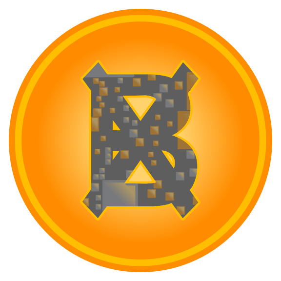
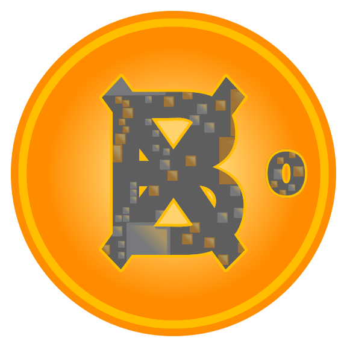
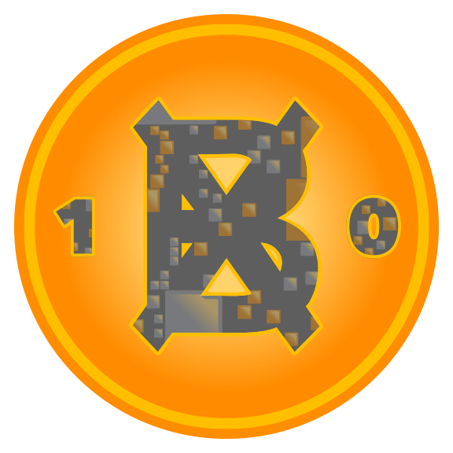
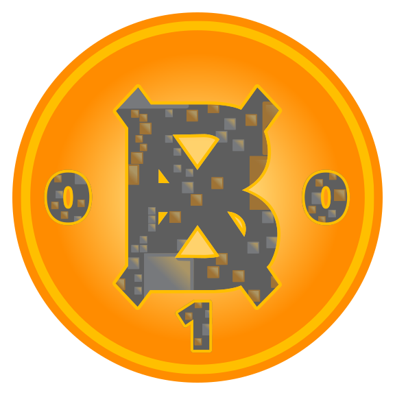
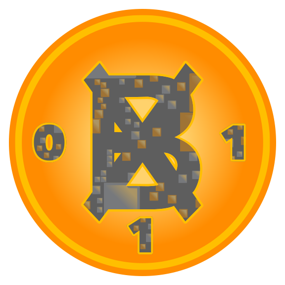
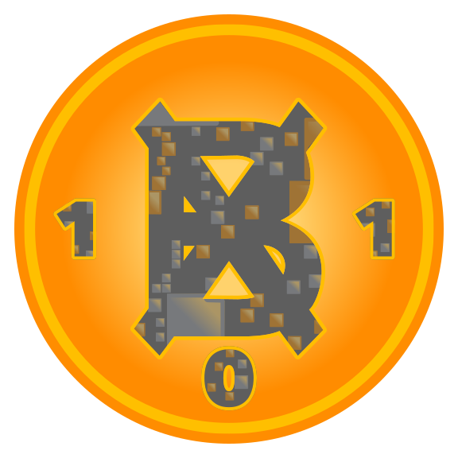
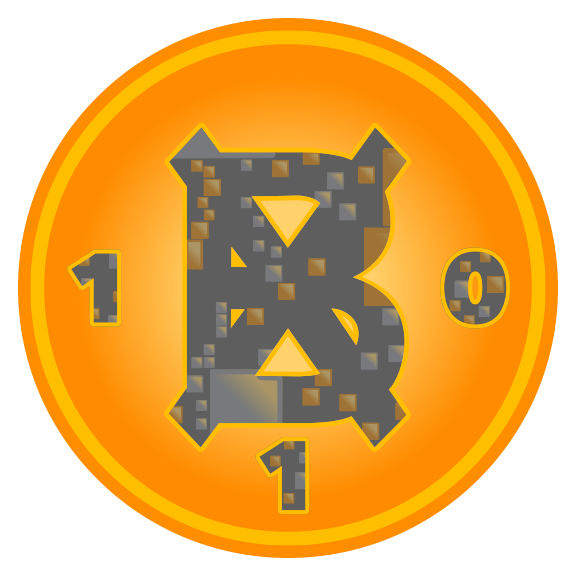
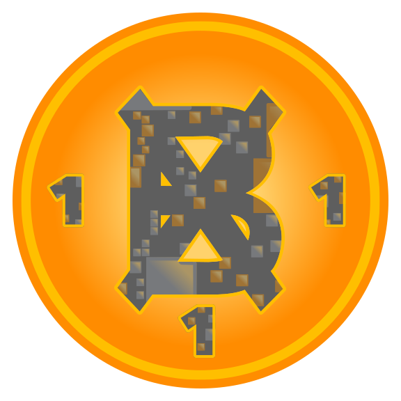

# bitnats

**🟠** the rarest digital artifacts **🟠**

# bx.bitnats

**⦻** bitnats' bits hex collection **⦻**

## basics

🟠 bx.bitnats are [ordinal inscriptions](https://docs.ordinals.com/) on Bitcoin  
🟠 bx.bitnats are on-chain claims to Bitcoin block data using the [tap protocol](https://github.com/Trac-Systems/tap-protocol-specs)  
🟠 bx.bitnats are derived from Digital Matter Theory [DMT](https://digital-matter-theory.gitbook.io/digital-matter-theory)  
🟠 bx.bitnats are generated each time a Bitcoin block is mined 
🟠 bx.bitnats are available to mint on [mscribe.io](https://mscribe.io/nats?t=latest)  

## stats

the bx.bitnats [dune dashboard](https://dune.com/bitgnat/bx-bitnats) provides the following stats:
📙 rarity **Spectrum**  
📙 available **Supply**  
📙 **Collection** supply  
📙 **Rarity**  
📙 rate of **Expansion**  
📙 collection **Growth Rate**

## collection

### UNATs

bits hex pattern: `0`  
DMT element: `bitnats.0.11.element`  

bits hex pattern : `00`  
DMT element: `bitnat00.00.11.element`  

bits hex pattern : `01`  
DMT element: `matter.01.11.element`  

bits hex pattern : `1`  
DMT element: `bitnat1.1.11.element`  

bits hex pattern : `10`  
DMT element: `bitnat10.10.11.element`  

bits hex pattern : `11`  
DMT element: `Eleven.11.11.element`  

bits hex pattern : `010`  
DMT element: `ᘛ⁐̤ᕐᐷ.010.11.element`  

bits hex pattern : `011`  
DMT element: `bitnat011.011.11.element`  

bits hex pattern : `100`  
DMT element: `100.100.11.element`  

bits hex pattern : `101`  
DMT element: `lol.101.11.element`  

bits hex pattern : `110`  
DMT element: `bitnat110.110.11.element`  

bits hex pattern : `111`  
DMT element: `genesis.111.11.element`  

